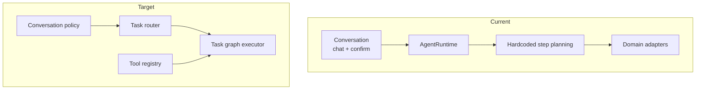

# OpenPCB Agent 架构（Current + Target）

## 背景

OpenPCB 的 Agent 负责“任务决策与执行编排”，而不是直接承载 PCB 导出格式细节。

- Current：单 `AgentRuntime` + 命令式 tool 调用 + chat 对话路由
- Target：可扩展 tool registry + 更强路由策略 + task graph

## 现状（Current）

实现状态：`已实现`（基础闭环）

### 分层
- Conversation Orchestrator：`chat` 文本意图路由、写盘确认（`/yes`、`/no`）
- Runtime：`run(task_type, input_payload, options)` 执行循环
- Tools：`intent/planner/save/load/build/check/edit`
- Domain adapters：对接 parser/planner/builder/checker/executor

### 执行模型
- 固定循环：`observe -> plan_steps -> step retry -> reflect -> finalize(trace)`
- 每步输出 `ToolResult`，任务输出 `RunResult`
- trace 文件写入：`logs/agent-run-*.jsonl`

### 任务链路
- `plan`：intent -> planner(mock/llm) -> save
- `build`：load project -> build artifacts
- `check`：load project -> run checks
- `edit`：load project -> apply edit -> save/report

## 目标（Target）

实现状态：`进行中`

- Tool Registry：工具注册与发现统一化（替代 runtime 内硬编码步骤）
- 路由策略：关键词规则升级为“策略路由（规则 + LLM 决策）”
- Task Graph：支持同一任务中的可扩展步骤图与中断恢复
- 更细粒度错误分类：输入错误、工具错误、可重试错误、不可恢复错误

## 边界与职责

### Agent 负责（已实现）
- 决定做什么（task_type）
- 以统一循环执行工具链
- 产生日志与结果摘要

### Agent 不负责（已实现边界）
- KiCad 具体格式的领域建模细节
- 器件布局/布线算法
- 模板库内容定义

这些由 PCB Domain/IR 流水线负责（见 `pcb-pipeline-architecture.md`）。

## 关键接口（稳定契约）

- `run(task_type, input_payload, options) -> RunResult`
- `ToolResult`：`ok/data/error/message`
- `RunResult`：`ok/task_type/outputs/trace_file/error`

稳定性说明：`task_type` 与 `RunResult` 字段语义不随 chat 或 provider 切换而变化。

## 结构图（双视图）

## 失败模式与恢复

### Current
- `plan` 缺少 API key：明确错误返回（`InputError`），REPL 可继续
- 某 step 失败：按 `retries` 重试，最终失败并写 trace
- 未 plan 就 build/edit：会话层阻断并提示先 plan

### Target（进行中）
- 失败分级可观测（error code）
- 可恢复步骤重放（按 task graph）

## 测试映射

- Runtime 主链路：`tests/cli/test_plan_build.py`
- Chat 路由与确认：`tests/cli/test_chat.py`
- 会话状态：`tests/agent/test_session.py`
- 模型配置与 planner 解析：`tests/agent/test_config_loader.py`、`tests/agent/test_planner_json_parse.py`

## 下一步

1. 把 runtime 的 `_plan_steps` 重构为 registry + policy。
2. 为 `check/edit` 增加更清晰的错误分级与恢复语义。
3. 将 Agent 与 PCB 流水线的接口固定为显式 IR 契约。
