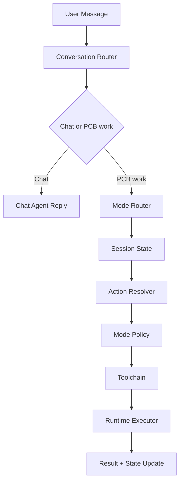

# OpenPCB Agent Architecture (Current + Target)

## Background

OpenPCB Agent is responsible for conversation, intent routing, task orchestration, and execution policy.
It should not bind PCB workflow stages directly to concrete tools too early.

This document defines the new target architecture around:

- `mode` as the current PCB work perspective
- `action` as the stable execution verb
- `toolchain` as a late-bound implementation detail

## Current

Implementation status: `已实现` for the basic runtime loop, `进行中` for conversation-first orchestration

### Current layering

- Conversation Orchestrator: `chat` REPL, confirmation flow, slash commands
- Runtime: `run(task_type, input_payload, options)`
- Hardcoded task execution: `PLAN / BUILD / CHECK / EDIT`
- Domain adapters: parser, planner, builder, checker, executor

### Current execution model

- Fixed loop: `observe -> plan_steps -> step retry -> reflect -> finalize`
- Step chains are selected only by `task_type`
- Runtime writes trace logs to `logs/agent-run-*.jsonl`

### Current problems

- `task_type` is too coarse for real PCB work
- There is no explicit representation of the current PCB work perspective
- Adding PCB phases directly as new task types would make runtime harder to evolve
- Tools are implicitly coupled to tasks instead of selected by policy

## Target

Implementation status: `未开始`

### Core principle

The agent should decide:

1. whether the user is chatting or entering PCB work
2. which `mode` best matches the current work perspective
3. which `action` should be executed in that mode
4. which toolchain should be selected by policy

The key rule is:

`mode != action != tool`

### Mode

`mode` represents the current PCB work perspective, not a hardcoded process state.

Recommended initial modes:

- `system_architecture`
- `schematic_design`
- `schematic_check`
- `placement`
- `power_layout`
- `routing`

Mode responsibilities:

- define current focus
- constrain available actions
- provide prompt and policy defaults
- select preferred tool families later

### Action

`action` is the stable execution verb.

Recommended initial actions:

- `analyze`
- `plan`
- `generate`
- `check`
- `edit`
- `review`
- `export`

Actions should remain more stable than modes and tools.

### Toolchain

`toolchain` is a policy-resolved execution chain for one `(mode, action)` pair.

Examples:

- `schematic_design + plan` may use intent parsing, context normalization, and schematic planning
- `power_layout + check` may later use rule checks and power integrity heuristics

At this stage, toolchains should remain abstract contracts, not concrete KiCad bindings.

## Proposed components

### 1) Conversation Router

- decides chat vs PCB work
- extracts candidate mode and action
- decides whether clarification or confirmation is needed

### 2) Mode Router

- maps user text and session context to a target mode
- updates session mode when confidence is sufficient
- supports explicit mode switching later

### 3) Session State

- stores `current_mode`
- stores normalized project context
- stores recent results and pending actions
- stores confirmed constraints and assumptions

### 4) Action Resolver

- resolves the final action under the current mode
- rejects unsupported `(mode, action)` pairs
- normalizes user input into runtime payloads

### 5) Mode Policy

- selects the toolchain for a `(mode, action)` pair
- defines mode-specific prompt or guardrails
- keeps tool binding outside the top-level router

### 6) Runtime Executor

- executes the resolved toolchain
- keeps retry, trace, and error handling generic
- should not encode PCB phase semantics directly

## Target data flow

## Session model

### Recommended session fields

- `current_mode`
- `project_context`
- `pending_action`
- `last_result`
- `confirmed_constraints`
- `assumptions`

### Important design rule

Mode is a working viewpoint, not a one-way workflow stage.

For example:

- the user may move from `placement` back to `schematic_design`
- the user may run `check` repeatedly in different modes
- the user may stay in one mode while switching actions

This matches real PCB iteration better than a strict linear pipeline state machine.

## Compatibility with current runtime

### Current stable contract

- `run(task_type, input_payload, options) -> RunResult`

### Target evolution

The current runtime should evolve toward:

- `resolve(mode, action, context) -> toolchain`
- `run(toolchain, input_payload, options) -> RunResult`

This keeps the runtime generic and removes hardcoded PCB stage logic from `_plan_steps()`.

## Minimal v1 landing plan

Implementation status: `进行中`

### Scope

Start with only two modes:

- `system_architecture`
- `schematic_design`

Start with only two actions:

- `plan`
- `check`

### Why this scope

- enough to validate mode routing
- enough to validate mode-specific policy without a large tool surface
- avoids overfitting early runtime design to future KiCad integrations

## Failure modes

### Risks if mode is treated as task

- too many task enums
- duplicated tool orchestration
- high coupling between user phrasing and execution chain

### Risks if mode is treated as rigid workflow state

- difficult iteration across phases
- awkward support for review, backtracking, and partial edits
- session state becomes fragile when users switch topics

### Target mitigation

- treat mode as perspective
- keep action stable
- use policy to bind toolchains late

## Test mapping

Future tests should cover:

- mode routing from natural language
- unsupported `(mode, action)` rejection
- session mode transitions
- policy resolution for `(mode, action)`
- runtime execution remaining independent from concrete mode semantics

## Next steps

1. Add `ModeType` and `current_mode` to session state.
2. Add `ModeRouter` and `ActionResolver`.
3. Replace hardcoded runtime `_plan_steps()` with policy resolution.
4. Implement v1 for `system_architecture` and `schematic_design`.
