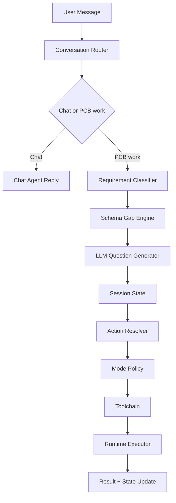

# OpenPCB Agent Architecture (Current + Target)

## Background

OpenPCB Agent handles conversation, intent routing, and task execution orchestration.
Current implementation already has a conversation-first entry, and architecture collection is now unified into a schema-gap-driven path.

This document tracks architecture around:

- `mode` as current PCB work perspective
- `action` as execution verb
- `toolchain` as runtime implementation detail

## Current

Implementation status: conversation shell and schema gate `已实现`; mode/action/toolchain full decoupling `进行中`.

### Current layering

- Conversation Orchestrator: `chat` REPL + slash commands + confirmation
- Requirement Gate Layer:
  - `RequirementClassifier` (`board_class + board_family`)
  - `ArchitectureSchemaCollector` (template-driven gap engine)
  - `SchemaQuestionGenerator` (LLM dynamic question wording)
- Runtime: `run(task_type, input_payload, options)`
- Task execution chain: `PLAN / BUILD / CHECK / EDIT`
- Domain adapters: parser, planner, builder, checker, executor

### Current execution model

- Fixed runtime loop by `task_type`
- Trace logs written to `logs/agent-run-*.jsonl`
- Board-design conversation path:
  - classify board type
  - enter schema gap collection (single active field per round)
  - ask user with `1/2/3/4` protocol (3 template options + custom)
  - allow `plan` only when `architecture_ready=True`

### Current delivered capabilities

- `openpcb` default enters interactive shell
- Session mode persistence and restore (`current_mode`)
- Pending flow stages:
  - `classified`
  - `brief_collecting` (name retained for compatibility, behavior is schema-driven)
  - `ready_to_plan`
- Stage status standard output:
  - `current_stage`
  - `architecture_ready`
  - `schematic_ready`
  - `layout_ready`
  - `missing_fields`
  - `assumptions`
- Plan metadata injection:
  - `project.metadata.classification`
  - `project.metadata.architecture_brief`
  - `project.metadata.architecture_brief_sources`
  - `project.metadata.architecture_stage_status`
  - `project.metadata.architecture_brief_template_id`
  - `project.metadata.architecture_brief_template_version`

### Current problems

- Runtime is still `task_type`-centric; mode policy is not fully extracted
- Conversation routing logic is still embedded in `chat.py`
- Session field names still contain historical `brief_*` prefixes

## Target

Implementation status: `进行中`.

### Core principle

The agent decides:

1. chat vs PCB work
2. target `mode`
3. target `action` in that mode
4. policy-selected toolchain

Rule: `mode != action != tool`.

### Mode

`mode` is work perspective, not direct tool binding.

Current and planned set:

- `system_architecture`
- `schematic_design`
- `schematic_check`
- `placement`
- `power_layout`
- `routing`

### Action

Stable verbs:

- `analyze`
- `plan`
- `generate`
- `check`
- `edit`
- `review`
- `export`

### Toolchain

Policy maps `(mode, action)` to executable chain.

## Proposed components

### 1) Conversation Router

- chat vs PCB routing
- clarification/confirmation decision

### 2) Schema Gap Engine

- load board-class template from `templates/architecture_fields/*.json`
- rank missing fields by `P0 -> P1 -> P2`
- expose single active question each round

### 3) Session State

- persist `current_mode`
- persist pending flow metadata
- persist architecture values/sources/stage status/template info

### 4) Action Resolver

- resolve executable action under current mode

### 5) Mode Policy

- bind `(mode, action)` to toolchain

### 6) Runtime Executor

- execute toolchain with unified trace and retry

## Target data flow

## Test mapping

Current implemented tests:

- `tests/agent/test_session.py`
- `tests/agent/test_classifier.py`
- `tests/agent/test_architecture_schema_collector.py`
- `tests/agent/test_schema_question_generator.py`
- `tests/agent/test_no_legacy_brief_imports.py`
- `tests/cli/test_architecture_schema_collector_flow.py`
- `tests/cli/test_chat.py`

## Next steps

1. Extract router logic from `chat.py` into dedicated module.
2. Complete `mode/action/toolchain` policy resolution in runtime.
3. Migrate session naming from `brief_*` to `schema_*` with compatibility shim.
4. Add stage-aware entry gates for schematic/layout handoff.