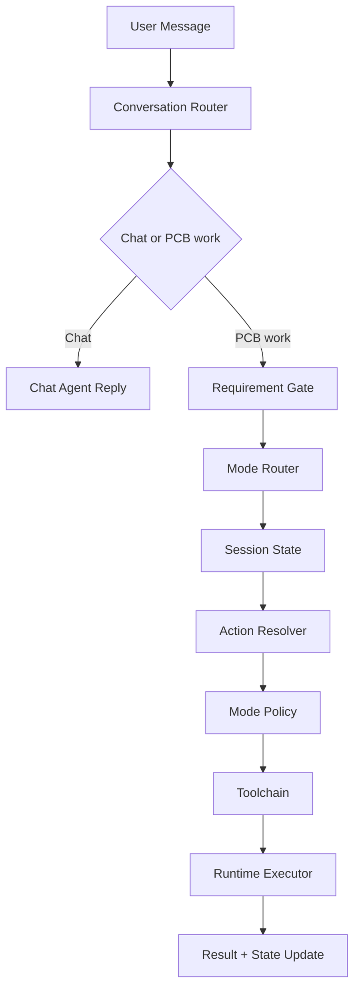

# OpenPCB Agent Architecture (Current + Target)

## Background

OpenPCB Agent is responsible for conversation, intent routing, task orchestration, and execution policy.
It should not bind PCB workflow stages directly to concrete tools too early.

This document defines the target architecture around:

- `mode` as the current PCB work perspective
- `action` as the stable execution verb
- `toolchain` as a late-bound implementation detail

## Current

Implementation status: `已实现` for the basic runtime loop, `进行中` for conversation-first orchestration.

### Current layering

- Conversation Orchestrator: `chat` REPL, slash commands, confirmation flow
- Requirement Gate Layer: requirement classifier + architecture brief collector
- Runtime: `run(task_type, input_payload, options)`
- Hardcoded task execution: `PLAN / BUILD / CHECK / EDIT`
- Domain adapters: parser, planner, builder, checker, executor

### Current execution model

- Fixed loop: `observe -> plan_steps -> step retry -> reflect -> finalize`
- Step chains are selected by `task_type`
- Runtime writes trace logs to `logs/agent-run-*.jsonl`
- For board-design text input:
  - classify board type (`board_class + board_family`)
  - enter architecture brief Q&A gate (6 required fields)
  - allow `plan` only when brief is complete

### Current delivered capabilities

- Conversation-first shell default entry
- User-readable chat output for classification and action prompts
- Session mode persistence and restore (`current_mode`)
- Pending stage metadata for conversation flow:
  - `classified`
  - `brief_collecting`
  - `ready_to_plan`
- Metadata injection to planning output:
  - `project.metadata.classification`
  - `project.metadata.architecture_brief`

### Current problems

- Runtime is still `task_type`-centric; no real `mode/action/toolchain` resolution yet
- Conversation routing logic is embedded in CLI command flow, not an explicit router module
- Brief collector is rule-based and stores raw user text; structure normalization is still missing

## Target

Implementation status: `进行中`.

### Core principle

The agent should decide:

1. whether the user is chatting or entering PCB work
2. which `mode` best matches the current work perspective
3. which `action` should be executed in that mode
4. which toolchain should be selected by policy

Key rule:

`mode != action != tool`

### Mode

`mode` represents work perspective, not a rigid workflow state.

Recommended initial modes:

- `system_architecture`
- `schematic_design`
- `schematic_check`
- `placement`
- `power_layout`
- `routing`

### Action

`action` is the stable execution verb.

Recommended initial actions:

- `analyze`
- `plan`
- `generate`
- `check`
- `edit`
- `review`
- `export`

### Toolchain

`toolchain` is a policy-resolved execution chain for one `(mode, action)` pair.

## Proposed components

### 1) Conversation Router

- decides chat vs PCB work
- extracts candidate mode and action
- decides whether clarification or confirmation is needed

### 2) Mode Router

- maps user text and session context to target mode
- updates session mode when confidence is sufficient

### 3) Session State

- stores `current_mode`
- stores pending action and decision metadata
- stores `architecture_brief` and completeness state

### 4) Action Resolver

- resolves final action under current mode
- rejects unsupported `(mode, action)` pairs

### 5) Mode Policy

- resolves `(mode, action) -> toolchain`
- keeps tool binding outside top-level router

### 6) Runtime Executor

- executes resolved toolchain
- keeps retry, trace, and error handling generic

## Target data flow

## Test mapping

Current implemented tests:

- `tests/agent/test_session.py`
- `tests/agent/test_classifier.py`
- `tests/agent/test_brief_collector.py`
- `tests/cli/test_chat.py`

Future tests should add:

- explicit mode routing tests
- unsupported `(mode, action)` rejection tests
- policy resolution tests decoupled from CLI flow

## Next steps

1. Add explicit `ModeType` enum and remove stringly-typed mode usage.
2. Extract conversation routing from chat command into dedicated router module.
3. Add `ModeRouter` and `ActionResolver` on top of current stage metadata.
4. Replace runtime hardcoded `_plan_steps()` with policy-resolved toolchains.
