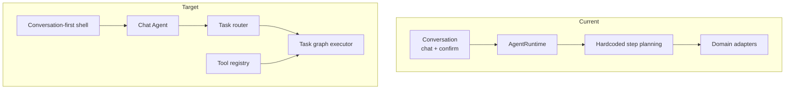

# OpenPCB Agent 架构（Current + Target）

## 背景

OpenPCB 的 Agent 负责“对话、任务决策与执行编排”，而不是直接承载 PCB 导出格式细节。

- Current：单 `AgentRuntime` + 命令式 tool 调用 + `chat` 对话路由
- Target：conversation-first shell + Chat Agent + task router + 可扩展 tool registry

## 现状（Current）

实现状态：`已实现`（基础闭环）

### 分层
- Conversation Orchestrator：`chat` 文本意图路由、写盘确认（`/yes`、`/no`）
- Runtime：`run(task_type, input_payload, options)` 执行循环
- Tools：`intent/planner/save/load/build/check/edit`
- Domain adapters：对接 parser/planner/builder/checker/executor

### 执行模型
- 固定循环：`observe -> plan_steps -> step retry -> reflect -> finalize(trace)`
- 每步输出 `ToolResult`，任务输出 `RunResult`
- trace 文件写入：`logs/agent-run-*.jsonl`

### 当前问题
- `chat` 更像“命令路由器”，而不是“对话优先的 agent shell”
- 普通文本会直接映射到 `plan/build/check/edit`，缺少独立的纯聊天通道
- `openpcb` 默认入口仍是 CLI help，而不是交互式会话

## 目标（Target）

实现状态：`进行中`

- Conversation-first Shell：`openpcb` 无参数直接进入交互界面
- Chat Agent：先负责稳定对话，再决定是否升级为任务请求
- Task Router：把对话消息判定为普通问答或 `plan/build/check/edit`
- Tool Registry：工具注册与发现统一化（替代 runtime 内硬编码步骤）
- Task Graph：支持同一任务中的可扩展步骤图与中断恢复
- 更细粒度错误分类：输入错误、工具错误、可重试错误、不可恢复错误

## 边界与职责

### Agent 负责（已实现）
- 决定做什么（`task_type`）
- 以统一循环执行工具链
- 产生日志与结果摘要

### Chat Agent 负责（目标，进行中）
- 维护多轮对话历史
- 组织 LLM 请求与自然语言回复
- 生成欢迎词、引导提示与下一步建议
- 判断是“继续聊天”还是“升级为任务执行”

### Agent 不负责（已实现边界）
- KiCad 具体格式的领域建模细节
- 器件布局/布线算法
- 模板库内容定义

这些由 PCB Domain/IR 流水线负责，见 [pcb-pipeline-architecture.md](e:/projects/3-Ai-agent/OpenPCB/docs/architecture/pcb-pipeline-architecture.md)。

## 关键接口（稳定契约）

- `run(task_type, input_payload, options) -> RunResult`
- `ToolResult`：`ok/data/error/message`
- `RunResult`：`ok/task_type/outputs/trace_file/error`

稳定性说明：`task_type` 与 `RunResult` 字段语义不随 chat 或 provider 切换而变化。

## Chat Agent v1

实现状态：`未开始`

### 目标
- 先打通稳定对话，不直接执行 PCB 任务
- 让 `openpcb` 进入后就是一个可持续交流的 agent shell

### 建议结构
- `Shell`：负责读取输入、渲染欢迎词、slash 命令、退出
- `ChatSession`：负责保存消息历史、session id、日志路径、当前配置
- `ChatAgent`：负责把历史消息组织成 LLM 请求并输出自然语言回复
- `TaskRouter`：后续用于把某些对话升级为 `plan/build/check/edit`

### v1 行为边界
- 默认行为：普通文本直接与大模型对话
- 保留控制命令：`/help`、`/exit`、`/clear`、`/status`
- 暂不自动执行：`plan/build/check/edit`
- 写盘动作确认流保留到 v2 再接回

## 结构图（双视图）

## 失败模式与恢复

### Current
- `plan` 缺少 API key：明确错误返回（`InputError`），REPL 可继续
- 某 step 失败：按 `retries` 重试，最终失败并写 trace
- 未 plan 就 build/edit：会话层阻断并提示先 plan

### Target（进行中）
- 对话失败时优先保证 shell 不退出，并提示配置或网络问题
- 普通聊天与任务执行分流，避免误触发写盘动作
- 失败分级可观测（error code）
- 可恢复步骤重放（按 task graph）

## 测试映射

- Runtime 主链路：`tests/cli/test_plan_build.py`
- Chat 路由与确认：`tests/cli/test_chat.py`
- 会话状态：`tests/agent/test_session.py`
- 模型配置与 planner 解析：`tests/agent/test_config_loader.py`、`tests/agent/test_planner_json_parse.py`

## 下一步

1. 新增 `ChatAgent`，让 `openpcb` 默认先成为对话 shell。
2. 在 chat shell 中先实现纯 LLM 对话通道，再引入 `TaskRouter`。
3. 把 runtime 的 `_plan_steps` 重构为 registry + policy。
4. 将 Agent 与 PCB 流水线的接口固定为显式 IR 契约。
