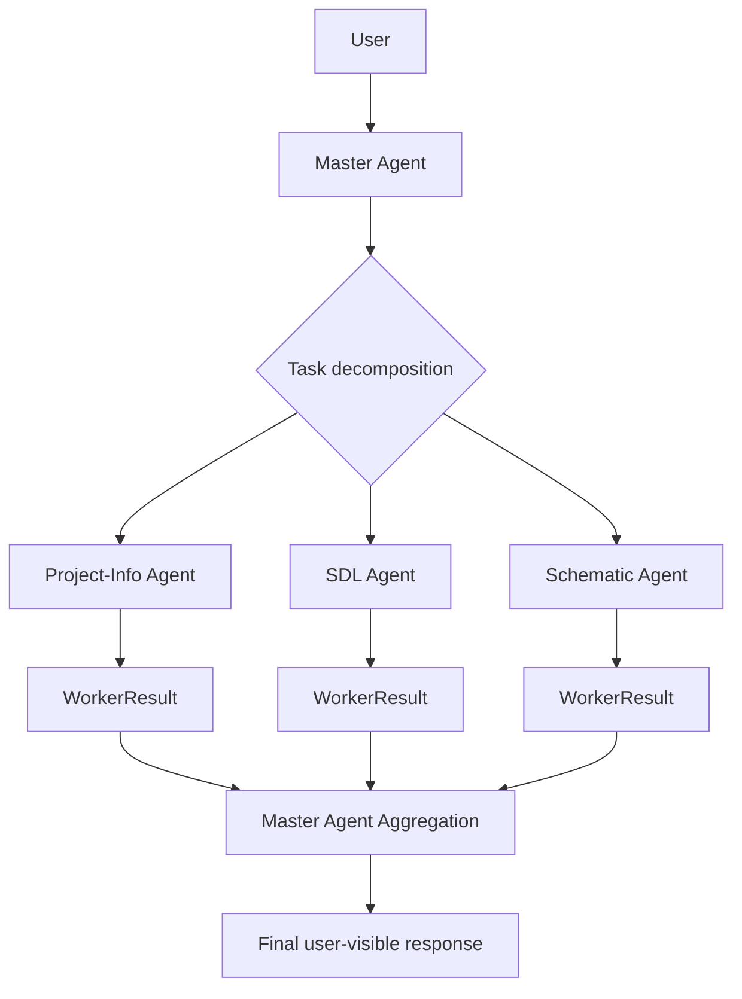

# OpenPCB Agent Architecture (Current + Target)

## Background

OpenPCB agent orchestration is being refocused from a single-agent, task-type driven loop to a `pi-mono`-based `agent-team` model.

This document defines:

- Current architecture and constraints
- Target `Master Agent + Worker Agents` collaboration model
- Concept-level collaboration contracts and flow

## Current

Implementation status: `已实现` (single-agent baseline), `进行中` (mode/action decoupling).

### Current architecture shape

- Conversation entry is available via interactive shell.
- Runtime still centers on `task_type` chains (`PLAN / BUILD / CHECK / EDIT`).
- Requirement and architecture collection already use schema-gap style collection.
- Session persists mode and stage-related metadata.

### Current limitations

- Orchestration remains mostly single-agent and task-centric.
- Worker specialization and delegation boundaries are not explicit.
- The conversation layer still carries part of routing logic.

## Target

Implementation status: `进行中`.

### Core direction

Use `pi-mono` as the orchestration base and build an `agent-team` pattern:

- `Master Agent` talks to user and owns final output.
- `Worker Agents` execute domain-specific tasks.
- SDL remains the upstream semantic source for circuit intent.

### Master Agent responsibilities

- User conversation and intent clarification
- Task decomposition and dispatch
- Worker assignment and dependency ordering
- Result aggregation and conflict arbitration
- Final user-facing response generation

### Worker Agents (MVP)

1. `Project-Info Agent`
- Maintains `docs/project/knowledge-base.md`
- Synchronizes project facts from architecture, SDL, and project docs
- Rejects undocumented assumptions and prefers repository-grounded facts

2. `SDL Agent`
- Updates SDL-level circuit semantic descriptions
- Performs structured SDL updates and consistency checks
- Does not generate schematic drawing artifacts directly

3. `Schematic Agent`
- Transforms SDL-derived intent into schematic expression/artifacts
- Reports unresolved semantic gaps back to Master Agent
- Current phase note: schematic semantic architecture is still being refined

## Collaboration Contracts (Concept-Level)

The team contract is language-agnostic at this stage.

### TaskEnvelope

```text
TaskEnvelope {
  task_id,
  agent_role,
  goal,
  inputs,
  constraints,
  expected_output
}
```

### WorkerResult

```text
WorkerResult {
  task_id,
  status,
  artifacts,
  summary,
  open_questions
}
```

### Contract constraints

- Only Master Agent is allowed to produce final user-visible conclusions.
- Worker Agents return structured execution results and open questions.
- Cross-worker conflicts are resolved by Master Agent before final response.

## Target data flow



## Relationship with SDL stack

- SDL docs under `docs/sdl/` remain the semantic authority for design intent.
- `SDL Agent` and `Schematic Agent` consume and produce artifacts consistent with SDL semantics.
- This document does not redefine SDL syntax or semantic rules.

## Next steps

1. Define runtime-level delegation policy from Master Agent to worker roles.
2. Add observable task lifecycle states for worker execution tracking.
3. Introduce failure-handling policy for partial worker completion.
4. Incrementally refine schematic semantic contracts in SDL-related docs.
