# OpenPCB PCB 主链路架构（IR -> Build -> Export）

## 背景

本文件专门描述 PCB 工程链路，不讨论对话体验细节。
目标是固定从需求到 KiCad 产物的中间表示（IR）与接口边界。

与 conversation shell 的关系：
- Chat Agent 负责“是否进入 PCB 流水线”的判定
- 一旦进入任务模式，PCB 流水线从结构化输入开始，不直接依赖终端交互细节

## 现状（Current）

实现状态：`进行中`

- Intent Parser：`已实现`（关键词解析）
- IR Schema：`已实现`（`ProjectSpec/ModuleSpec/NetSpec/Component`）
- Planner：`已实现`（规则 + LLM，输出 `ProjectSpec`）
- Builder：`已实现`（mock 导出写盘）
- Exporter：`未开始`（尚未从 builder 独立成模块）
- Checker：`进行中`（基础规则，非完整引擎）

## 目标（Target）

实现状态：`进行中`

- 将 PCB 主链路固定为：
  `parse -> IR builder/normalizer -> planner -> build -> export -> check`
- 明确 build 与 export 分工：
  - `build` 负责结构准备与中间对象
  - `export` 负责输出 KiCad/BOM/Netlist
- 所有阶段围绕 IR 传递，避免跨层直写文件

## 与对话系统的衔接

实现状态：`未开始`

### 建议边界
- 对话阶段输出两类结果：
  - `ChatReply`：继续自然语言回复
  - `TaskProposal`：建议进入 `plan/build/check/edit`
- 只有 `TaskProposal` 被确认后，才进入 PCB 流水线

### 进入 PCB 流水线的最小输入
- `plan`：自然语言需求或已整理的项目上下文
- `build/check/edit`：`project_dir` 或 `project.json`

### 设计原则
- PCB 流水线不直接消费原始聊天日志
- Chat Agent 如需传递上下文，应先归一化为任务输入载荷

## 阶段职责与接口（v1）

### 1) Intent Parser
- 输入：`requirement: str`
- 输出：`Intent`
- 接口：`parse(requirement) -> Intent`
- 状态：`已实现`

### 2) IR Builder / Normalizer
- 输入：`Intent | project_context`
- 输出：规范化 `ProjectSpec`
- 接口：`normalize(intent|context) -> ProjectSpec`
- 状态：`未开始`

### 3) Planner
- 输入：`Intent | project_context`
- 输出：`ProjectSpec`
- 接口：`plan(intent|project_context) -> ProjectSpec`
- 状态：`已实现`（normalizer 前置尚未接入）

### 4) Builder
- 输入：`ProjectSpec`
- 输出：`BuildBundle`
- 接口：`build(project_spec) -> BuildBundle`
- 状态：`未开始`（当前为直接写文件）

### 5) Exporter
- 输入：`BuildBundle` + `target`
- 输出：`ArtifactPaths`
- 接口：`export(build_bundle, target="kicad") -> ArtifactPaths`
- 状态：`未开始`

### 6) Checker
- 输入：`ProjectSpec | artifacts`
- 输出：`CheckReport`
- 接口：`check(project_spec|artifacts) -> CheckReport`
- 状态：`进行中`

## 数据流（双视图）

```mermaid
flowchart TD
    subgraph Current
        C1[Requirement] --> C2[Intent Parser]
        C2 --> C3[Planner]
        C3 --> C4[ProjectSpec]
        C4 --> C5[Builder direct write]
        C5 --> C6[KiCad/BOM/Netlist]
        C4 --> C7[Checker]
    end

    subgraph Target
        T0[Confirmed TaskProposal]
        T1[Requirement] --> T2[Intent Parser]
        T2 --> T3[IR Builder/Normalizer]
        T3 --> T4[Planner]
        T4 --> T5[ProjectSpec]
        T5 --> T6[Builder]
        T6 --> T7[BuildBundle]
        T7 --> T8[Exporter]
        T8 --> T9[KiCad/BOM/Netlist]
        T5 --> T10[Rule Checker]
        T0 --> T1
    end
```

## 失败模式

### Current
- Intent 解析弱：关键词覆盖有限
- Builder 直接写文件：缺中间对象导致扩展 exporter 困难
- Checker 规则少：只能给出基础 warning/error

### Target
- 统一阶段输入输出校验，错误定位到具体阶段
- Exporter 失败不影响 IR 存续，支持重试导出

## 测试映射

- `tests/cli/test_plan_build.py`：plan/build 结果产物
- `tests/cli/test_check_edit.py`：check/edit 基础行为
- `tests/agent/test_planner_json_parse.py`：planner 输出结构化校验

## 下一步

1. 引入 `BuildBundle` 类型并改造 builder 返回值。
2. 新增 exporter 层，接管 KiCad/BOM/Netlist 写盘。
3. 增加 IR normalizer，作为 planner 前置阶段。
4. 对 checker 建立规则插件接口，提升覆盖深度。
5. 定义 `TaskProposal -> runtime input_payload` 的归一化适配层。
