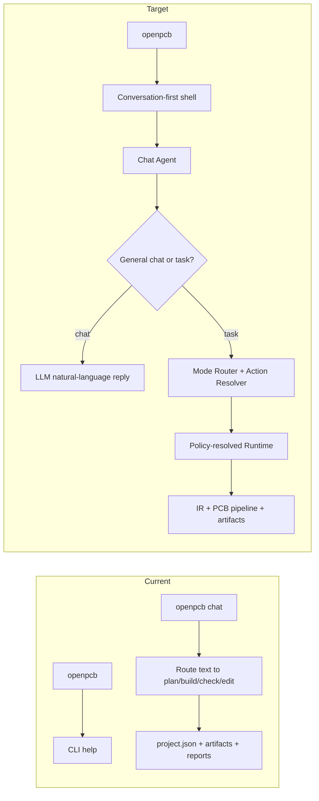
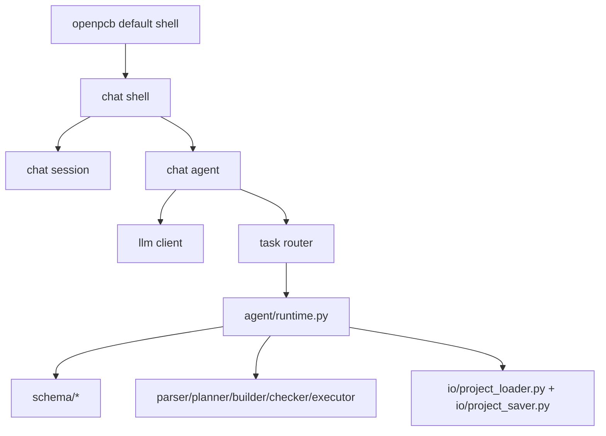

# OpenPCB 系统总体架构（Current + Target）

## 背景

OpenPCB 不仅是 AI 调用层，而是从需求到 PCB 工程产物的完整链路系统。
本文件描述系统级分层、默认交互入口和端到端数据契约。

## 现状（Current）

实现状态：`已实现`（MVP 主链路）

### 七层分层（Current）
1. CLI Layer：`init/plan/build/check/edit/chat`
2. Conversation Layer：`chat` 自动路由与确认
3. Runtime Layer：单 Agent 执行循环
4. IR/Schema Layer：`ProjectSpec/ModuleSpec/NetSpec/Component`
5. PCB Domain Layer：parser/planner/builder/checker/executor（部分为规则/mock）
6. IO/Exporter Layer：project load/save、构建产物落盘（exporter 细分进行中）
7. Config/LLM Layer：provider/model/key/base_url 配置与 LLM client

### 当前入口形态
- `openpcb` 无参数时显示 help
- `openpcb chat` 才会进入交互 REPL
- REPL 内的普通文本优先走任务路由，而不是纯聊天

## 目标（Target）

实现状态：`进行中`

- 默认入口改为 conversation-first shell：`openpcb` 直接进入交互界面
- Chat Agent 作为第一入口，优先支持纯对话
- PCB 执行能力退到二线，由 `Conversation Router + Mode Router + Action Resolver + Runtime` 负责承接
- IR 标准化：将规划与构建统一绑定到 `ProjectSpec` IR 管线
- PCB Domain 深化：模板装配 + 规则引擎 + exporter 分层
- Exporter 接口化：从 builder 中解耦导出职责，支持 KiCad/BOM/Netlist 的标准输出接口

### 新的编排原则
- `mode` 表示当前 PCB 工作视角
- `action` 表示稳定执行动作
- `toolchain` 由策略层后置解析
- 模式不直接绑定具体工具
- 模式不是严格单向流程状态

## 端到端主流程（双视图）

## 产物契约（中间 + 最终）

### 中间产物（Current: 部分已实现）
- `ProjectSpec`：IR 主对象（已实现）
- Module/Net/Component 结构（已实现）
- `BuildBundle`：构建中间对象（未开始，当前由 builder 直接写文件）
- Chat history：当前只有 session 事件日志，标准消息结构未开始

### 最终产物（Current: 已实现）
- `<project>/project.json`
- `<project>/plan.md`
- `<project>/output/kicad/*.kicad_pro`
- `<project>/output/kicad/*.kicad_sch`
- `<project>/output/bom.json`
- `<project>/output/netlist.json`
- `<project>/output/reports/*.md`
- `<project>/logs/session-*.jsonl`
- `<project>/logs/agent-run-*.jsonl`

## Conversation Shell v1

实现状态：`未开始`

### 能力边界
- `openpcb` 直接进入 shell
- 首屏给出欢迎词与引导提示
- 普通文本直接调用 LLM，支持多轮历史
- 控制命令限定为：`/help`、`/exit`、`/clear`、`/status`
- 先不自动执行 `plan/build/check/edit`

### v1 目标
- 先验证“稳定对话”
- 再把任务执行接回 conversation shell

## 模块依赖图（Target）

## 失败模式

### Current
- 配置缺失：`plan/chat` 直接失败并给出明确提示
- build/check/edit 输入路径错误：加载失败并返回错误
- 规则深度不足：可生成报告但检查覆盖有限

### Target（进行中）
- 对话时缺 key 或网络失败：shell 不退出，给出可执行的配置修复提示
- 纯聊天与任务执行分离，避免误执行写盘动作
- 后续引入 task 模式时，所有写盘动作必须经过明确确认

## 测试映射

- CLI 主链路：`tests/cli/test_plan_build.py`、`tests/cli/test_check_edit.py`
- Chat 主链路：`tests/cli/test_chat.py`
- Schema/配置：`tests/agent/test_config_loader.py`、`tests/agent/test_planner_json_parse.py`

## 下一步

1. 为会话增加 `current_mode`，固定 mode/action 基础概念。
2. 引入 `Mode Router` 与 `Action Resolver`，替代直接按 task 粗路由。
3. 让 runtime 从硬编码 task steps 演进为 policy-resolved toolchain。
4. 从 `system_architecture` 和 `schematic_design` 两个模式开始验证架构。
