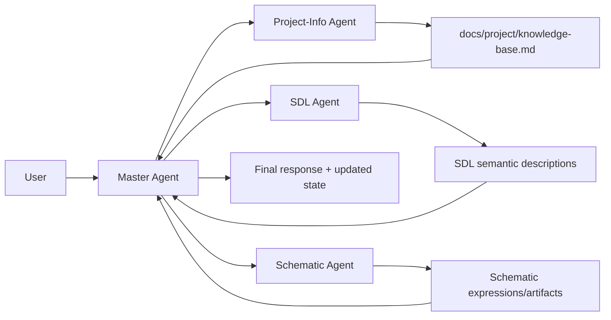

# OpenPCB System Architecture (Current + Target)

## Background

OpenPCB is a design-intent-driven engineering system. The current architecture is transitioning toward an agent-team orchestration model based on `pi-mono`, while keeping SDL as the upstream semantic contract.

This document describes system-level layering, end-to-end flow, and artifact boundaries.

## Current

Implementation status: `已实现` (MVP mainline), `进行中` (new orchestration landing).

### Current layering

1. Interface layer: CLI and interactive shell
2. Conversation and routing layer
3. Runtime execution layer (task-type oriented)
4. Schema/IR layer (`project` and related schemas)
5. Domain processing and validation chain
6. Artifact IO and logs

### Current behavior characteristics

- Conversation-first interaction already exists in practice.
- Runtime still primarily follows task-type pipelines.
- SDL documentation system exists and defines semantic positioning for design intent.

## Target

Implementation status: `进行中`.

### System direction

- Move orchestration to `pi-mono + agent-team`.
- Keep SDL as upstream authoritative semantic description.
- Separate user dialogue ownership from specialized worker execution.

### Agent Team placement in system

Mainline:

`User -> Master Agent -> Worker Agents -> SDL / Knowledge Base / Schematic artifacts`

Where worker set for current phase is:

- `Project-Info Agent`
- `SDL Agent`
- `Schematic Agent`

### End-to-end target flow

## Artifact contracts

### Upstream semantic contract

- SDL (`docs/sdl/`) remains the semantic source of truth for circuit design intent.
- Downstream schematic output must align with SDL semantics.

### Project knowledge contract

- `docs/project/knowledge-base.md` stores consolidated project facts.
- Knowledge updates are maintained by `Project-Info Agent` with repository-grounded evidence.

## Failure modes and constraints

### Current known risks

- Task-type runtime and team delegation are not fully unified yet.
- Worker-level failure reporting format is still evolving.

### Target control principles

- Master Agent performs final conflict arbitration before user-visible output.
- Worker outputs must be structured and traceable.
- Unresolved semantic gaps must be surfaced explicitly, not silently ignored.

## Next steps

1. Add delegation lifecycle and trace model in runtime.
2. Align worker output schema with aggregation logic.
3. Define SDL-to-schematic semantic gap checklist for iterative closure.
