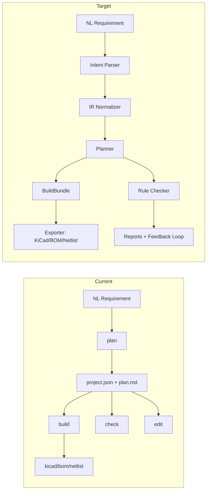
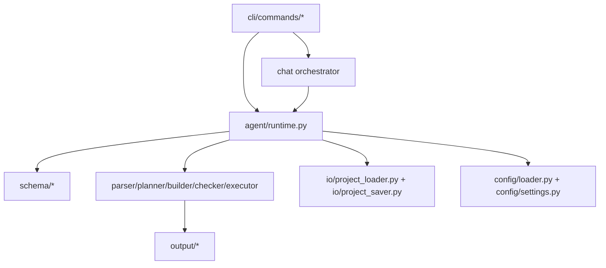

# OpenPCB 系统总体架构（Current + Target）

## 背景

OpenPCB 不仅是 AI 调用层，而是从需求到 PCB 工程产物的完整链路系统。
本文件描述系统级分层与端到端数据契约。

## 现状（Current）

实现状态：`已实现`（MVP 主链路）

### 七层分层（Current）
1. CLI Layer：`init/plan/build/check/edit/chat`
2. Conversation Layer：chat 自动路由与确认
3. Runtime Layer：单 Agent 执行循环
4. IR/Schema Layer：`ProjectSpec/ModuleSpec/NetSpec/Component`
5. PCB Domain Layer：parser/planner/builder/checker/executor（部分为规则/mock）
6. IO/Exporter Layer：project load/save、构建产物落盘（exporter 细分进行中）
7. Config/LLM Layer：provider/model/key/base_url 配置与 LLM client

## 目标（Target）

实现状态：`进行中`

- IR 标准化：将规划与构建统一绑定到 `ProjectSpec` IR 管线
- PCB Domain 深化：模板装配 + 规则引擎 + exporter 分层
- Exporter 接口化：从 builder 中解耦导出职责，支持 KiCad/BOM/Netlist 的标准输出接口
- 系统可回放：日志与产物可关联到每次任务的输入与决策

## 端到端主流程（双视图）

## 产物契约（中间 + 最终）

### 中间产物（Current: 部分已实现）
- `ProjectSpec`：IR 主对象（已实现）
- Module/Net/Component 结构（已实现）
- `BuildBundle`：构建中间对象（未开始，当前由 builder 直接写文件）

### 最终产物（Current: 已实现）
- `<project>/project.json`
- `<project>/plan.md`
- `<project>/output/kicad/*.kicad_pro`
- `<project>/output/kicad/*.kicad_sch`
- `<project>/output/bom.json`
- `<project>/output/netlist.json`
- `<project>/output/reports/*.md`
- `<project>/logs/session-*.jsonl`
- `<project>/logs/agent-run-*.jsonl`

## 模块依赖图（Current）

## 失败模式

### Current
- 配置缺失：`plan/chat` 直接失败并给出明确提示
- build/check/edit 输入路径错误：加载失败并返回错误
- 规则深度不足：可生成报告但检查覆盖有限

### Target（进行中）
- 引入 exporter 与 checker 的标准错误码与可追踪上下文
- 在系统层支持“步骤失败后建议下一步动作”

## 测试映射

- CLI 主链路：`tests/cli/test_plan_build.py`、`tests/cli/test_check_edit.py`
- Chat 主链路：`tests/cli/test_chat.py`
- Schema/配置：`tests/agent/test_config_loader.py`、`tests/agent/test_planner_json_parse.py`

## 下一步

1. 从 builder 中拆分 exporter 接口，落地 BuildBundle。
2. 把 checker 升级为规则引擎并对接 IR。
3. 建立 IR 规范化步骤（normalizer）并接入 plan/build 共享链路。
